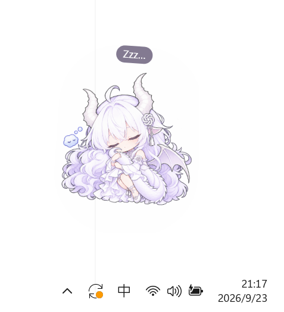

# DragonDeskPet

一只轻量、透明、可拖动的 Windows Q 版龙娘桌宠，也是一个与模型供应商解耦的桌面 AI 助手。

> A lightweight native Windows dragon-girl desktop pet with a provider-neutral AI boundary.

<p align="center">
  
</p>

## 当前版本

V0.1 已完成并通过 12 项自动冒烟测试。正式版本包含透明桌宠窗口、七种角色状态、托盘控制、便携式设置、迷你聊天气泡、单实例唤醒、首次启动引导、崩溃日志和统一程序图标。

V0.2 的截图问 AI、剪贴板、文件拖入和提醒功能尚未加入。

## 下载与运行

1. 从 [DragonDeskPet V0.1 Release](https://github.com/Konata147/DragonDeskPet/releases/tag/v0.1.0) 下载 `DragonDeskPet-v0.1.0-win-x64.zip`。
2. 将 ZIP 完整解压到普通文件夹，推荐放在 D 盘等用户选择的位置。
3. 双击 `DragonDeskPet.exe`。

官方 V0.1 ZIP 已自带 .NET 运行环境，适用于 64 位 Windows 10/11，不需要另外安装 .NET。当前版本没有安装程序和数字签名，Windows 首次运行时可能显示来源确认提示。

## 操作方式

| 操作 | 效果 |
| --- | --- |
| 拖动 | 移动桌宠并保存位置 |
| 鼠标滚轮 | 调整桌宠大小 |
| 单击 | 显示或隐藏快捷栏 |
| 双击 | 打开或关闭迷你聊天气泡 |
| 快速连点 | 触发生气状态 |
| 右键 | 打开桌宠菜单 |
| 关闭可见窗口 | 隐藏到系统托盘 |
| 再次启动程序 | 唤醒已有桌宠，不创建第二个常驻实例 |

拖动结束后，桌宠会短暂进入开心状态再恢复待机；即使在角色外、跨屏幕或窗口失焦后松开，也不会一直停留在“被拎起”状态。

## V0.1 功能

- `Idle`、`Hover`、`Dragged`、`Thinking`、`Happy`、`Angry`、`Sleeping` 七种状态。
- 七张独立透明角色素材，单张损坏或缺失时只回退该状态。
- 可切换置顶、持久化位置与 60%–200% 缩放。
- 托盘显示、隐藏、设置和退出。
- 一次性非模态操作引导。
- OpenAI 兼容接口与离线响应，不绑定单一模型供应商。
- Windows 当前用户范围加密保存 API Key。
- 本地崩溃日志、敏感信息脱敏和最近十份保留策略。

## 本地数据与隐私

设置、日志和运行数据保存在程序旁的 `data/` 文件夹。项目、构建缓存、NuGet 缓存和发布输出都可以留在当前驱动器。

程序不会在用户主动发送聊天内容前向模型服务发送数据。API Key 不以明文写入设置文件，崩溃日志不记录聊天文本、请求头或完整密钥。

## 从源码构建

需要 Windows 和 .NET 8 SDK：

```powershell
.\scripts\build.ps1
.\scripts\test.ps1
.\scripts\run.ps1
```

脚本会把 .NET CLI 和 NuGet 缓存固定在项目目录中。普通便携版可运行：

```powershell
.\scripts\publish.ps1
```

## 项目结构

- `src/DragonDeskPet/`：WPF 桌宠程序。
- `tests/DragonDeskPet.SmokeTests/`：状态、素材、设置、单实例、日志和图标测试。
- `assets/character/`：七张正式角色状态素材。
- `assets/icons/`：程序与托盘图标。
- `docs/`：需求、素材规范和验收清单。
- `scripts/`：构建、测试、运行和发布脚本。

## 授权

程序源代码采用 [MIT License](LICENSE)。角色美术、程序图标和其他视觉素材不属于 MIT 授权范围，具体规则见 [ASSET_LICENSE.md](ASSET_LICENSE.md)。参考原图不包含在仓库或发布包中。
