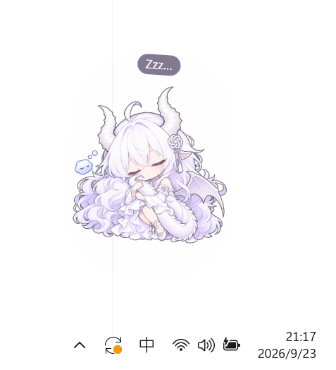

# DragonDeskPet

[](https://github.com/Konata147/DragonDeskPet/actions/workflows/build-and-test.yml)

一只轻量、透明、可拖动的 Windows Q 版龙娘桌宠，也是一个与模型供应商解耦的桌面 AI 助手。

> A lightweight native Windows dragon-girl desktop pet with a provider-neutral AI boundary.

<p align="center">
  
</p>

## 当前版本

当前版本为 **V0.5.0**，重点增加角色独立动作、直接鼠标互动、五种点心、三支舞蹈和小 AI 的低频回应。V0.4 的课表与校园功能继续保留；本地课表识图不需要 API Key，也不上传图片。

构建前执行 `scripts/get-ocr-models.ps1`，下载并校验锁定版本的本地中文模型；发布脚本会自动完成此步骤。实际用户课表与图片不包含在仓库中。参见 [V0.5 发布说明](docs/RELEASE_NOTES_V0.5.0.md)、[升级与回退指引](docs/UPGRADE_V0.5.md)及原有 [V0.4 验收记录](docs/v0.4-acceptance.md)。系统 DPI 完整矩阵及部分异常环境尚未完整实测；重要课程请勿只依赖桌宠提醒。

V0.3.0 已完成，在原有桌宠、聊天和截图体验之外加入完全本地的“校园效率助手”：今日清单、提醒、番茄钟和大学课程表。效率数据只保存在本机；不需要配置 AI 接口也能使用这些功能。

`main` 分支在每次推送和合并请求时通过 GitHub Actions 使用 Windows 与稳定版 .NET 8 自动执行零警告构建和全部冒烟测试。

历史版本功能与边界见各版本发布说明；V0.5 仍没有后台剪贴板监控或云同步。

## 下载与运行

1. 从 [DragonDeskPet V0.5.0 Release](https://github.com/Konata147/DragonDeskPet/releases/tag/v0.5.0) 下载 `DragonDeskPet-v0.5.0-win-x64.zip`。
2. 将 ZIP 完整解压到普通文件夹，推荐放在 D 盘等用户选择的位置。
3. 双击 `DragonDeskPet.exe`。

官方 V0.5 ZIP 已自带 .NET 运行环境及本地 OCR 模型，适用于 64 位 Windows 10/11，不需要另外安装 .NET。教务窗口需 WebView2；缺失时提供用户确认的便携下载入口。当前版本没有安装程序和数字签名，Windows 首次运行时可能显示来源确认提示。

## 操作方式

| 操作 | 效果 |
| --- | --- |
| 拖动 | 移动桌宠并保存位置 |
| 左键长按桌宠约 550 毫秒 | 贴贴一次；开始拖动或双击则取消长按 |
| 在头顶轻轻往返扫动 | 摸摸头；有冷却以免误触 |
| 轻点小 AI | 小 AI 单独回应；从它的位置拖动仍可移动桌宠 |
| 靠近桌宠后使用点心、音符、星星 | 投喂、选择舞蹈、蹦一蹦；点心拖到嘴边，目标外释放或 Esc 取消 |
| 鼠标滚轮 | 调整桌宠大小 |
| 单击 | 显示或隐藏紧凑图标快捷栏 |
| 双击 | 打开或关闭迷你聊天气泡 |
| 快捷栏“截图”/右键“截图问我” | 选择屏幕区域，预览并确认后交给 AI |
| 快捷栏“粘贴”/右键“剪贴板问我” | 主动读取当前剪贴板文字或图片，不自动发送 |
| 拖入单张图片 | 预览 PNG、JPG、BMP、GIF 或 TIFF，确认后交给 AI |
| 快速连点 | 触发生气状态 |
| 右键 | 打开桌宠菜单 |
| 关闭可见窗口 | 隐藏到系统托盘 |
| 再次启动程序 | 唤醒已有桌宠，不创建第二个常驻实例 |
| 前台程序进入全屏 | 默认自动隐藏，退出全屏后静默恢复 |

拖动结束后，桌宠会短暂进入开心状态再恢复待机；即使在角色外、跨屏幕或窗口失焦后松开，也不会一直停留在“被拎起”状态。

安静待机时，小 AI 偶尔邀请你选择点心或舞蹈；点击邀请才展开选择栏，不会自动启动动作。设置里可关闭待机动作或减少动态效果。

## V0.5 互动

- 招呼、摸头、贴贴、蹦跳、伸展、张望和庆祝等互动各有独立的一次性过程，结束后回到稳定站姿；入睡时保持闭眼睡姿。
- 五种点心分别有接食回应；三支约八秒的舞蹈分别采用轻快踏步、国风轻舞与翼尾合拍。国风轻舞没有内置歌曲或复刻特定编舞。
- 小 AI 保持原有小尺寸，针对点心与舞蹈作不同表情回应；睡眠、隐藏或新动作会中断旧回应。
- 动作素材缺失时回退静态状态图；「减少动态效果」使用代表性静态姿势。

## V0.1 功能

- `Idle`、`Hover`、`Dragged`、`Thinking`、`Happy`、`Angry`、`Sleeping` 七种状态。
- 七张独立透明角色素材，单张损坏或缺失时只回退该状态。
- 可切换置顶、持久化位置与 60%–200% 缩放。
- 托盘显示、隐藏、设置和退出。
- 一次性非模态操作引导。
- OpenAI 兼容接口与离线响应，不绑定单一模型供应商。
- Windows 当前用户范围加密保存 API Key。
- 本地崩溃日志、敏感信息脱敏和最近十份保留策略。

## V0.2 功能

- 单显示器内的区域截图，支持多显示器、负坐标与 Per-Monitor V2 DPI。
- 剪贴板文字/图片主动读取，以及单张常见图片拖入桌宠。
- 图片内存预览、可编辑默认问题和明确的发送确认。
- 图片最长边限制为 2560 像素，编码后超过 8 MiB 时拒绝上传。
- OpenAI-compatible 视觉请求；模型不支持图片时给出可重试提示。
- 截图不写入磁盘，发送成功、移除或退出时清除内存数据。
- V0.2.1 快捷栏改为紧凑图标布局，置顶状态显示明确，并修复 200% 缩放时的角色与气泡裁切。
- 全屏程序运行时默认自动隐藏桌宠，退出全屏后恢复；手动隐藏不会触发自动恢复。

## V0.3 功能

- 角色旁的“今日 / 提醒 / 专注”三页迷你气泡。
- 单次提醒、每日提醒、逾期补发、5/10/30 分钟稍后提醒与可关闭声音。
- 严格本地解析“20分钟后”“明天 8:30”“每天 22:00”三类提醒语句，保存前必须确认。
- 25/5/15 分钟完整番茄循环，时长与长休轮次可调整，每阶段结束后手动确认下一阶段。
- 今日清单、未完成事项次日结转、已完成事项保留七天。
- 大学课程表、教学周、单双周、今天停课、课程提前提醒，以及 ICS/UTF-8 CSV 导入预览。
- 全屏时静默排队；手动隐藏时只发送一次托盘提示，不抢占当前程序焦点。

CSV 与 ICS 示例分别位于 `docs/course-template.csv` 和 `docs/course-template.ics`。课程、提醒、清单和番茄钟状态只保存在程序旁的 `data/productivity.json`，不会上传给模型服务。

## 本地数据与隐私

设置、日志和运行数据保存在程序旁的 `data/` 文件夹。V0.3 效率数据使用原子替换方式写入 `data/productivity.json`；损坏文件会先保留为带时间戳的 `.corrupt` 备份。项目、构建缓存、NuGet 缓存和发布输出都可以留在当前驱动器。

程序不会在用户主动点击发送前向模型服务发送聊天内容、截图、剪贴板内容或拖入图片。提醒语句、课程表、清单和番茄钟完全在本地处理，不交给 AI。程序不监控剪贴板；只有点击“粘贴”或“剪贴板问我”时才读取一次。待发送图片只保存在内存中，不写入配置、缓存、临时目录或日志。API Key 不以明文写入设置文件，崩溃日志不记录聊天文本、请求头、图片数据、效率内容或完整密钥。

V0.4 的「管理课表 → 图片识图」使用随包模型在本地识别，与「截图问 AI」不同。教务导入仅连接学校网站，密码由用户在学校登录页输入；窗口使用程序旁的独立隐私会话，关闭后清理。旧效率数据首次保存为 V0.4 格式前会保留 `.pre-v0.4.bak` 备份；升级前仍建议自行备份完整 `data` 目录。

## 从源码构建

需要 Windows 和 .NET 8 SDK：

```powershell
.\scripts\build.ps1
.\scripts\test.ps1
.\scripts\run.ps1
```

脚本会把 .NET CLI 和 NuGet 缓存固定在项目目录中。普通便携版可运行：

```powershell
.\scripts\publish.ps1
```

为当前版本生成自包含 Windows x64 ZIP 和 SHA-256 校验文件（不是创建 GitHub Release）：

```powershell
.\scripts\publish-release.ps1 -Version 0.5.0
```

发布脚本默认拒绝覆盖已有的同版本文件。若目录已存在，请先核对其用途；不要对含有用户 `data` 的运行目录使用 `-Force`，该参数会删除旧输出。脚本只生成本地文件，不会自行推送标签或创建 GitHub Release。

## 项目结构

- `src/DragonDeskPet/`：WPF 桌宠程序。
- `tests/DragonDeskPet.SmokeTests/`：状态、素材、设置、单实例、日志和图标测试。
- `assets/character/`：七张正式角色状态素材。
- `assets/icons/`：程序与托盘图标。
- `docs/`：需求、素材规范和验收清单。
- `scripts/`：构建、测试、运行和正式发布脚本。

## 授权

程序源代码采用 [MIT License](LICENSE)。角色美术、程序图标和其他视觉素材不属于 MIT 授权范围，具体规则见 [ASSET_LICENSE.md](ASSET_LICENSE.md)。参考原图不包含在仓库或发布包中。

## 参与贡献和安全

提交代码、文档或素材前请阅读 [CONTRIBUTING.md](CONTRIBUTING.md)。如果问题可能涉及密钥、隐私数据、网络传输或本地权限，请不要公开披露细节，并按照 [SECURITY.md](SECURITY.md) 中的方式报告。
